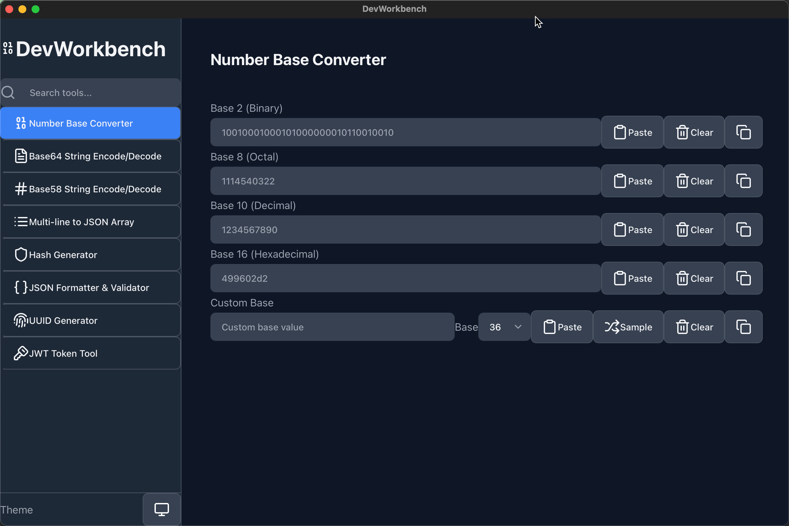

# DevWorkbench

A developer utilities application built with Tauri and React, similar to DevToys/DevUtils.



## 🤖 100% AI-Generated Code - A Totally Vibed Application

**This entire project was built using Vibe Coding through Claude Code, without any manual code editing by humans.** Every line of code, configuration, and even this README was generated through natural language conversations with AI. This demonstrates the power of AI-assisted development in creating fully functional applications.

DevWorkbench is a **Totally Vibed Application** - conceived, designed, and implemented entirely through AI collaboration.

## 🌟 Features

### ✅ Implemented
- 🔢 **Number Base Converter** - Convert between binary, octal, decimal, hex, and custom bases
- 📊 **Base64 String Encode/Decode** - Encode/decode text using Base64 with smart features
- 🔤 **Base58 String Encode/Decode** - Bitcoin/IPFS-friendly encoding without confusing characters
- 📝 **Multi-line to JSON Array** - Convert multi-line text to JSON array with auto-trim and smart type detection
- 🔐 **Hash Generator** - Generate MD5/SHA1/SHA2/SHA3/Keccak hashes using Rust for high performance
- 📝 **JSON Formatter & Validator** - Format, validate, and beautify JSON with collapsible viewer
- 🆔 **UUID Generator** - Generate and validate UUIDs v1/v3/v4/v5/v7 with bulk generation support
- 🔑 **JWT Token Tool** - Decode, encode, and verify JSON Web Tokens with multiple algorithms (HS256/384/512, RS256/384/512)

### 🚧 Coming Soon
- 🌐 **URL Tools** - Encoder/decoder, parser
- 🎨 **Color Picker** - Color converter and palette generator
- 🖼️ **Image Tools** - Resize, format conversion, optimization
- 🛠️ **Developer Tools** - More utilities coming soon

## 🚀 Tech Stack

- **Frontend**: React 18 + TypeScript + Vite
- **Backend**: Rust with Tauri 2.6
- **UI Framework**: Tailwind CSS + Radix UI
- **Package Manager**: npm

## 📦 Installation

### Download Pre-built Binaries

Download the latest release from the [Releases page](https://github.com/jiayun/DevWorkbench/releases).

#### macOS Installation

If you see "DevWorkbench.app is damaged" error on macOS:

**Option 1: Remove quarantine attribute (Recommended)**
```bash
xattr -cr /Applications/DevWorkbench.app
```

**Option 2: Right-click to open**
1. Right-click (or Control-click) on DevWorkbench.app
2. Select "Open" from the context menu
3. Click "Open" in the dialog that appears

**Option 3: System Settings**
1. Go to System Settings → Privacy & Security
2. Find the blocked app notification
3. Click "Open Anyway"

### Build from Source

#### Prerequisites

- Node.js 18+ and npm
- Rust 1.70+
- Platform-specific dependencies for Tauri

#### Development

```bash
# Clone the repository
git clone https://github.com/jiayun/DevWorkbench.git
cd DevWorkbench

# Install dependencies
npm install

# Start development server
npm run tauri dev
```

### Build

```bash
# Build for production
npm run tauri build
```

## 🛠️ Development

```bash
# Frontend only development
npm run dev

# Type checking
npx tsc --noEmit

# Format code
cd src-tauri && cargo fmt
```

## 📁 Project Structure

```
DevWorkbench/
├── src/                   # React frontend
│   ├── components/        # UI components
│   ├── lib/               # Utilities
│   └── assets/            # Static assets
├── src-tauri/             # Rust backend
│   ├── src/               # Rust source code
│   └── icons/             # App icons
└── public/                # Public assets
```

## 🤝 Contributing

Contributions are welcome! Please feel free to submit a Pull Request.

1. Fork the project
2. Create your feature branch (`git checkout -b feature/AmazingFeature`)
3. Commit your changes (`git commit -m 'Add some AmazingFeature'`)
4. Push to the branch (`git push origin feature/AmazingFeature`)
5. Open a Pull Request

## 📄 License

This project is licensed under the MIT License - see the [LICENSE](LICENSE) file for details.

## 🙏 Acknowledgments

- Inspired by [DevToys](https://github.com/veler/DevToys) and DevUtils
- Built with [Tauri](https://tauri.app/) - The secure framework for building desktop apps
- UI components from [Radix UI](https://www.radix-ui.com/)

---

⭐ Star this repo if you find it useful!
