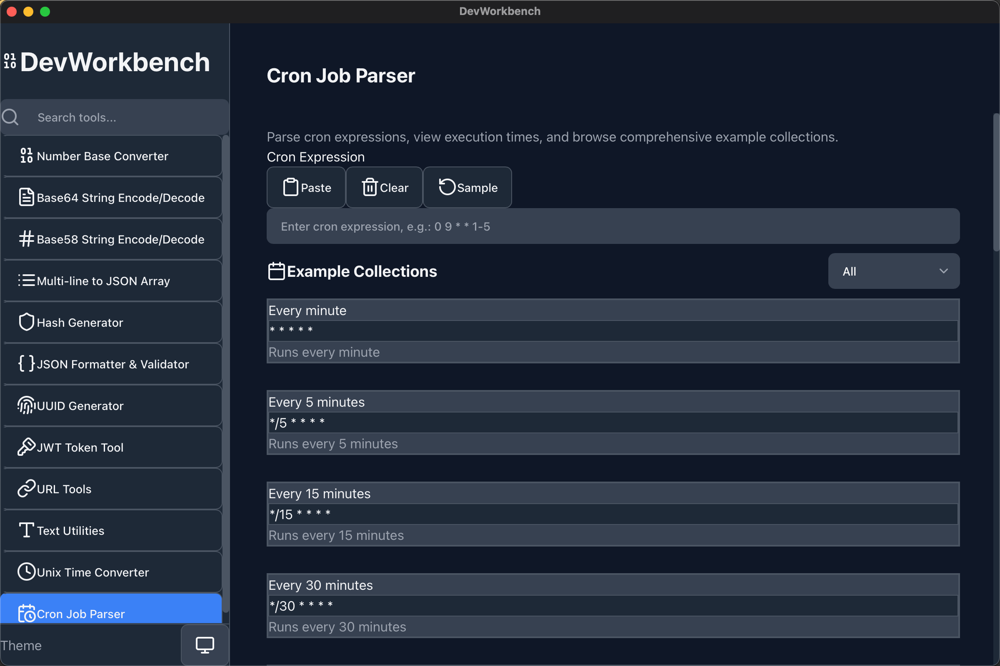

# Features

DevWorkbench provides a comprehensive collection of developer utilities designed to streamline your workflow. Each tool is carefully crafted with performance and usability in mind.

## 🔢 Number Base Converter

Convert numbers between different numeral systems with ease.

<!-- 截圖預留空間 -->

**Features:**
- Convert between binary, octal, decimal, and hexadecimal
- Support for custom bases (2-36)
- Real-time conversion as you type
- Copy results with one click

**Use Cases:**
- Converting memory addresses
- Working with color codes
- Binary arithmetic
- Custom encoding systems

---

## 📊 Base64 String Encode/Decode

Encode and decode Base64 strings with intelligent detection.

<!-- 截圖預留空間 -->

**Features:**
- Smart auto-detection of Base64 content
- Support for text and binary data
- URL-safe Base64 variant
- Instant encoding/decoding

**Use Cases:**
- Encoding credentials for APIs
- Embedding images in HTML/CSS
- Working with JWT tokens
- Data transmission

---

## 🔤 Base58 String Encode/Decode

Bitcoin and IPFS-friendly encoding without confusing characters.

<!-- 截圖預留空間 -->

**Features:**
- No confusing characters (0, O, I, l)
- Perfect for cryptocurrency applications
- Human-readable encoding
- Error detection

**Use Cases:**
- Bitcoin addresses
- IPFS content identifiers
- Short URL generation
- User-friendly IDs

---

## 📝 Multi-line to JSON Array

Transform multi-line text into properly formatted JSON arrays.

<!-- 截圖預留空間 -->

**Features:**
- Smart type detection (string, number, boolean)
- Auto-trim whitespace
- Handle empty lines
- Custom delimiters

**Use Cases:**
- Converting CSV data
- Processing log files
- Bulk data entry
- Configuration management

---

## 🔐 Hash Generator

Generate cryptographic hashes using Rust for maximum performance.

<!-- 截圖預留空間 -->

**Features:**
- MD5, SHA1, SHA256, SHA384, SHA512
- SHA3 variants (224, 256, 384, 512)
- Keccak variants
- Uppercase/lowercase output
- File hashing support

**Use Cases:**
- Verifying file integrity
- Password hashing
- Digital signatures
- Blockchain applications

---

## 📋 JSON Formatter & Validator

Format, validate, and beautify JSON with an interactive viewer.

<!-- 截圖預留空間 -->

**Features:**
- Syntax validation with error messages
- Collapsible tree view
- Minify/beautify options
- Syntax highlighting

**Use Cases:**
- API response debugging
- Configuration file editing
- Data structure visualization
- JSON schema validation

---

## 🆔 UUID Generator

Generate and validate UUIDs with support for multiple versions.

<!-- 截圖預留空間 -->

**Features:**
- UUID v1, v3, v4, v5, v7 support
- Bulk generation (up to 1000)
- UUID validation
- Namespace support for v3/v5

**Use Cases:**
- Database primary keys
- Distributed system IDs
- Session identifiers
- API keys

---

## 🔑 JWT Token Tool

Complete JWT token management with encoding, decoding, and verification.

<!-- 截圖預留空間 -->

**Features:**
- Support for HS256/384/512, RS256/384/512
- Token decoding and validation
- Custom claims editor
- Signature verification

**Use Cases:**
- API authentication
- Session management
- Token debugging
- Security testing

---

## 🌐 URL Tools

Comprehensive URL manipulation utilities.

<!-- 截圖預留空間 -->

**Features:**
- URL encoding/decoding
- Parse URL components
- Query string to JSON
- Build URLs from parts

**Use Cases:**
- API development
- Web scraping
- URL manipulation
- Query parameter handling

---

## 📝 Text Utilities

Essential text processing and conversion tools.

<!-- 截圖預留空間 -->

**Features:**
- HTML entities encode/decode
- Unicode conversion
- Case conversion (camelCase, snake_case, etc.)
- Text statistics

**Use Cases:**
- Code generation
- Data cleaning
- Content processing
- String manipulation

---

## ⏰ Unix Time Converter

Convert Unix timestamps with comprehensive time information.

<!-- 截圖預留空間 -->

**Features:**
- Timezone support
- Relative time display
- Multiple format options
- Leap year detection

**Use Cases:**
- Log analysis
- Date calculations
- Timezone conversions
- Event scheduling

---

## ⏱️ Cron Job Parser

Parse and validate cron expressions with human-readable descriptions.

<!-- 截圖預留空間 -->

**Features:**
- Human-readable descriptions
- Next execution predictions
- Example collections
- Syntax validation

**Use Cases:**
- Schedule configuration
- Cron debugging
- Task automation
- Time-based triggers
