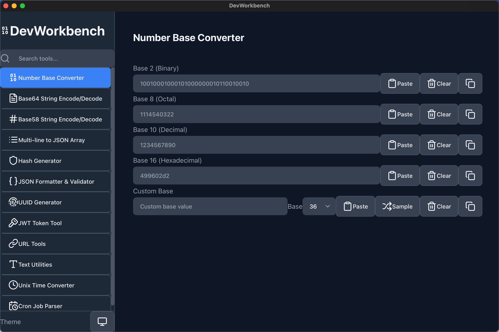

# DevWorkbench

**A developer utilities application built with Tauri and React**

  <!-- 主要截圖預留空間 -->
  

## 🤖 100% AI-Generated Code

**This entire project was built using Vibe Coding through Claude Code, without any manual code editing by humans.** Every line of code, configuration, and even the documentation was generated through natural language conversations with AI.

**UI Design & Collaboration**: The user interface design and layout adjustments were crafted through collaborative sessions with **Google Stitch**, showcasing how different AI tools can work together to create cohesive, well-designed applications.

DevWorkbench is a **Totally Vibed Application** - conceived, designed, and implemented entirely through AI collaboration.

## 🌟 Features at a Glance

  

    <h3>🔢 Number Base Converter</h3>
    
Convert between binary, octal, decimal, hex, and custom bases (2-36)

  

  
  

    <h3>📊 Base64 Encode/Decode</h3>
    
Smart Base64 encoding/decoding with automatic detection

  

  
  

    <h3>🔤 Base58 Encode/Decode</h3>
    
Bitcoin/IPFS-friendly encoding without confusing characters

  

  
  

    <h3>📝 Multi-line to JSON</h3>
    
Convert multi-line text to JSON array with smart type detection

  

  
  

    <h3>🔐 Hash Generator</h3>
    
Generate MD5/SHA1/SHA2/SHA3/Keccak hashes using Rust

  

  
  

    <h3>📋 JSON Formatter</h3>
    
Format, validate, and beautify JSON with collapsible viewer

  

  
  

    <h3>🆔 UUID Generator</h3>
    
Generate and validate UUIDs v1/v3/v4/v5/v7 with bulk support

  

  
  

    <h3>🔑 JWT Token Tool</h3>
    
Decode, encode, and verify JWT tokens with multiple algorithms

  

  
  

    <h3>🌐 URL Tools</h3>
    
Encode/decode URLs, parse structure, and build from components

  

  
  

    <h3>📝 Text Utilities</h3>
    
HTML entities, Unicode conversion, case conversion, and statistics

  

  
  

    <h3>⏰ Unix Time Converter</h3>
    
Convert timestamps with timezone support and detailed information

  

  
  

    <h3>⏱️ Cron Job Parser</h3>
    
Parse cron expressions with human-readable descriptions

  

  

    <h3>📄 OpenAPI Spec Filter</h3>
    
Filter and extract selected endpoints from OpenAPI specifications

  

  

    <h3>🔍 Regex Tester & Builder</h3>
    
Real-time regex matching with inline highlighting and match navigation

  

  

    <h3>🔤 Pangu Spacing 盤古之白</h3>
    
Auto-add spaces between CJK and half-width characters for readability

  

## 🚀 Quick Start

  <a href="https://github.com/jiayun/DevWorkbench/releases/latest" class="btn btn-primary">
    Download Latest Release
  </a>
  <a href="/installation" class="btn btn-secondary">
    Installation Guide
  </a>

## 💻 Tech Stack

- **Frontend**: React 18 + TypeScript + Vite
- **Backend**: Rust with Tauri 2.6
- **UI Framework**: Tailwind CSS + Radix UI
- **Package Manager**: npm

## 🤝 Contributing

Contributions are welcome! Please feel free to submit a Pull Request. Check out our [development guide](/development) to get started.

## 📄 License

This project is licensed under the MIT License.

---

⭐ Star this repo on [GitHub](https://github.com/jiayun/DevWorkbench) if you find it useful!
